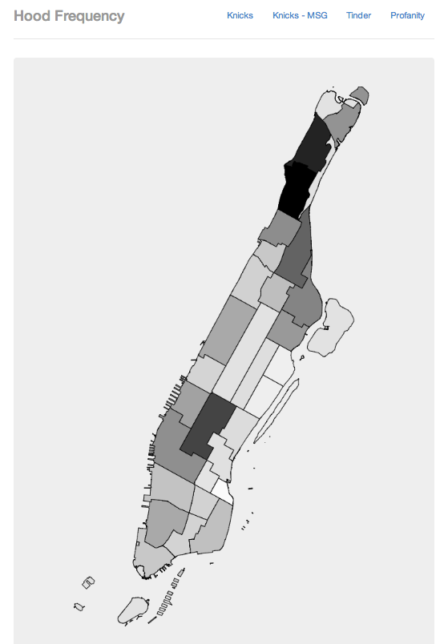

hoodFrequency
=============

Displays the frequency of terms coming out of NYC neighborhoods as a heat map.

Leverages the [ETL tool found here](https://github.com/dimroc/etl-language-comparison).

